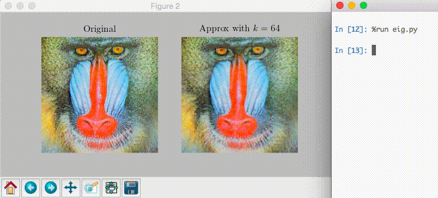

<!--XXX: UPDATE WITH-->
<!--python setup.py build-->
<!--python setup.py sdist upload-->

## `drawnow` for matplotlib

The scientific community often runs iterative code, often in the form of
simulation. It's often useful to see the results after each iteration.
Accordingly, MATLAB<sup>®</sup> has a nice feature that allows you to update
the figure, `drawnow`. This repo brings the same feature to Python's
matplotlib, with some extras.

Example:



This is shown with `imshow`, but python-drawnow allows updates of any figure.

Usage:

```python
# complete implementation of script found in test/test.py
from pylab import *
from drawnow import drawnow, figure
# if global namespace, import plt.figure before drawnow.figure

figure(figsize=(7, 7/2))
def draw_fig():
    subplot(1, 2, 1)
    imshow(x)

    subplot(1, 2, 2)
    imshow(x_hat)
    #show()

x = imread('mandrill.png').mean(axis=2)
k_values = around(logspace(0, 2, num=10))
for k in k_values:
    x_hat = approx(x, k)
    drawnow(draw_fig)
```
    
## Documentation
If you want to wait for confirmation after update or the option to drop into a
debugger, call `drawnow(function_to_draw_figure, confirm=True)`.

If you only want to show the figure once, call
`drawnow(function_to_draw_figure, show_once=True)`

`drawnow` does not work in IPython's QtConsole at least for me.

The full documentation is included in the doc strings.

## Installation
Two options:

1. Run `pip install drawnow`.
2. Download this repository and run `python setup.py install`.

### Changes to code
This does require *small* changes to your code. All it should really amount
to is moving `figure(); plot(...); show()` inside a function; not much.
